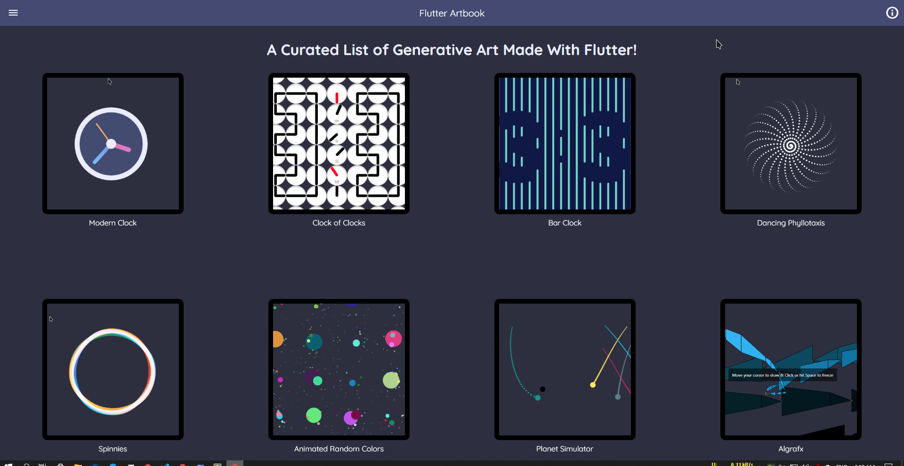

# Flutter-Artbook

A collection of generative art made using Flutter and Dart.

## App preview
 

## My Socials

[![Twitter][1.1]][1]
[![Facebook][2.1]][2]
[![Github][3.1]][3]

[1.1]: http://i.imgur.com/tXSoThF.png "twitter icon with padding"
[2.1]: http://i.imgur.com/P3YfQoD.png "facebook icon with padding"
[3.1]: http://i.imgur.com/0o48UoR.png "github icon with padding"

## Thanks

- Clock : [CodeX](https://www.youtube.com/watch?v=HyAeZKWWuxA) for the [tutorial](https://www.youtube.com/watch?v=HyAeZKWWuxA) and [IngeniousPixel](https://dribbble.com/ingeniouspixel) for the [Design](https://dribbble.com/shots/6738814-Clock-App-UI-screens)

- Dancing Phyllotaxis : [Chiziaruhoma Ogbonda](https://codepen.io/chiziaruhoma-ogbonda) for his [CodePen](https://codepen.io/chiziaruhoma-ogbonda/pen/NWxPyeo)

- Spinnies : [Brian Egan](https://codepen.io/phillywiggin) for his [CodePen](https://codepen.io/phillywiggins/pen/gOaPNPY)

- Color Test : [Chiziaruhoma Ogbonda](https://codepen.io/chiziaruhoma-ogbonda) for his [CodePen](https://codepen.io/chiziaruhoma-ogbonda/pen/oNjObRm)

- Planet Simulator : [Deven Joshi](https://codepen.io/Deven-Joshi) for his [CodePen](https://codepen.io/Deven-Joshi/pen/XWmyRYK)

- Algrafx : [rxlabz](https://codepen.io/rx-labz) for his [CodePen](https://codepen.io/rx-labz/pen/WNQoNem)

- Boid Simulation : [Dominik Roszkowski](https://codepen.io/orestesgaolin) for his [CodePen](https://codepen.io/orestesgaolin/pen/VwvWaoo)

- Sierpinski Triangle : [Dominik Roszkowski](https://codepen.io/orestesgaolin) for his [CodePen](https://codepen.io/orestesgaolin/pen/GRpMyOm)

- Animated Circles : [Jean-François Michel](https://codepen.io/jfmichel) for his [CodePen](https://codepen.io/jfmichel/pen/vYLBxNK)

- Space : [Vipul](https://codepen.io/vipul_kerai/) for his [CodePen](https://codepen.io/vipul_kerai/pen/XWXavBa)

- Game of life : [CodePen](https://codepen.io/team/codepen) for their [CodePen](https://codepen.io/team/codepen/pen/QWbvgWj)

- Clock of Clocks : [CodePen](https://codepen.io/team/codepen) for their [CodePen](https://codepen.io/team/codepen/pen/yLYeMEd)

- Sunflower : [CodePen](https://codepen.io/team/codepen) for their [CodePen](https://codepen.io/team/codepen/pen/zYGwzYE)

- Neumorphic Clock : [CodePen](https://codepen.io/team/codepen) for their [CodePen](https://codepen.io/team/codepen/pen/VwvepBW)

- BarBar Clock : [CodePen](https://codepen.io/team/codepen) for their [CodePen](https://codepen.io/team/codepen/pen/NWGxpzE)

- Double Pendulum Simulation : [Abhilash](https://codepen.io/abhilas-csc) for his [CodePen](https://codepen.io/abhilas-csc/pen/qBOZKPj)

- Long Shadow Animation : [Jonatan](https://codepen.io/jonathan_monga) for his [CodePen](https://codepen.io/jonathan_monga/pen/qBOQWgp)

- Paricle Playground : [creativecreatorormaybenot](https://codepen.io/creativecreatorormaybenot) for his [CodePen](https://codepen.io/creativecreatorormaybenot/pen/YzqKqpo)

[1]: http://www.twitter.com/ikramhasandev
[2]: http://www.facebook.com/ihni7/
[3]: https://github.com/ikramhasan/
